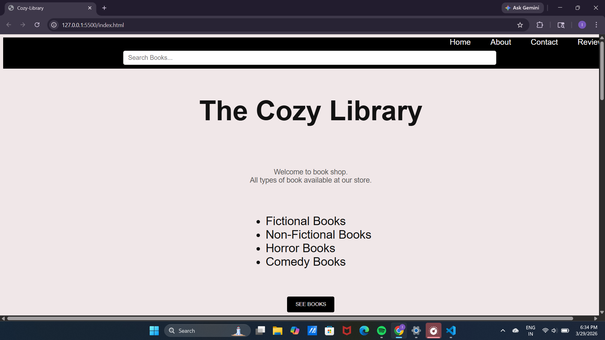
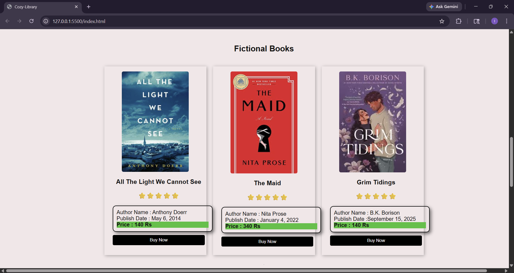
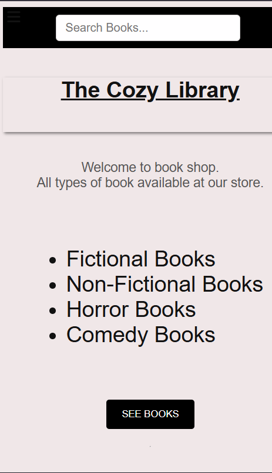
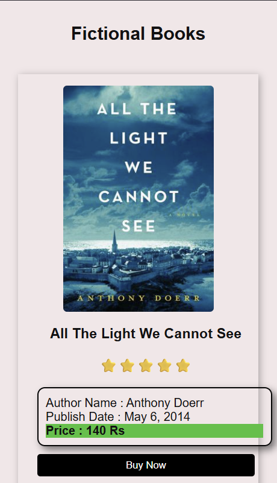

# cozy-library
Simple book store project
# The Cozy Library - Online Book Store

Welcome to **The Cozy Library**, a simple and responsive online book store where users can explore different categories of books and check out details like author, publish date, rating, and price.

---

## Features

- Browse books by categories: **Fictional, Non-Fictional, Comedy, Horror**  
- View book details: author, publish date, rating, and price  
- Responsive layout for **desktop and mobile**  
- Sidebar menu for easy navigation  
- Search bar for quick book search  
- Interactive buttons with hover effects  

---

## Project Structure
 book-store
│
1. index.html # Main HTML file    2.style.css # CSS styling for the project
3. screenshots/ # Folder containing project screenshots
4. images/ # All book images
5. README.md # Project overview and instructions

---

## Technologies Used

- **HTML5** – Structure of the website  
- **CSS3** – Styling, responsive design, hover effects, flexbox  
- **Font Awesome** – Icons for menu and buttons  
- **Google Fonts** – Custom fonts  

---

## Screenshots

Here are some screenshots of the project:
           
  
  
  
  

---

## How to Run Locally

1. **Download/Clone the repository**  
2. Open the project folder  
3. Open `index.html` in any modern browser (Chrome, Firefox, Edge, etc.)  

No server or installation needed!  

---

## Notes

- This project is for learning and portfolio purposes.        
